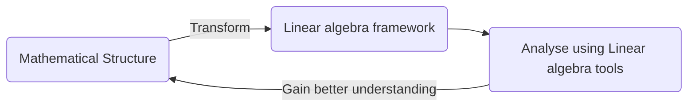

 

Algebra is the study of mathematical symbols and rules for manipulating these symbols. Linear algebra deals with linear equations, mappings and transformations. The core heart of Linear algebra is the system of linear equations. The most widespread notion is that, `Linear Algebra is the branch of mathematics aimed at solving systems of linear equations with a finite number of unknowns`. There is much more to Linear algebra, than what meets our eye here. Linear algebra provides a abstract notion on a collection of mathematical objects and the linear mappings and transformations between these objects. The bigger idea is that,

Linear algebra provides a comprehensive framework to understand and solve complex problems. Any mathematical problem can be expressed as a Linear albegra problem and solved using the concepts of Linear algebra. This constitutes to a theory of study called the Representation Theory. We will discuss about this in brief in the later notes.

> _If you can reduce a mathematical problem to a problem in Linear Algebra, you can most likely solve it, provided you know enough Linear Algebra_ - Peter D Lax

Linear algebra is also used in most sciences and fields of engineering, because it allows modeling many natural phenomena, and computing efficiently with such models. For nonlinear systems, which cannot be modeled with linear algebra, it is often used for dealing with first-order approximations, using the fact that the differential of a multivariate function at a point is the linear map that best approximates the function near that point[[1](https://en.wikipedia.org/wiki/Linear_algebra)]. Fore more applications, see the [Applications](https://en.wikipedia.org/wiki/Linear_algebra#Usage_and_applications) section in the Wikipedia page.

## References

1 - [Linear alegbra - Wikipedia](https://en.wikipedia.org/wiki/Linear_algebra)

2 - [Technion - Algebra 1M by Dr.Aviv Censor](https://www.youtube.com/playlist?list=PLW3u28VuDAHJNrf3JCgT0GG_rjFVz0-j9)

3 - [Essence of Linear Algebra by 3Blue1Brown - YouTube Playlist](https://www.youtube.com/playlist?list=PLZHQObOWTQDPD3MizzM2xVFitgF8hE_ab)

## Credits

Some of the visualizations or content in these notes are taken from few references mentioned above:

- A few visualizations are taken from [3Blue1Brown](https://www.3blue1brown.com)'s articles.

Feel free explore the original content.

